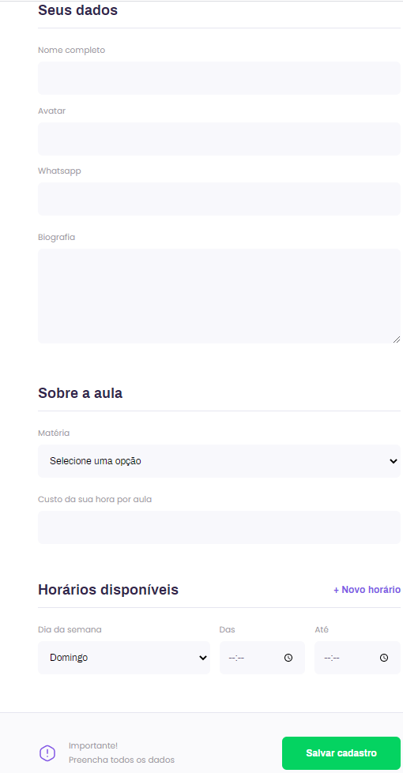
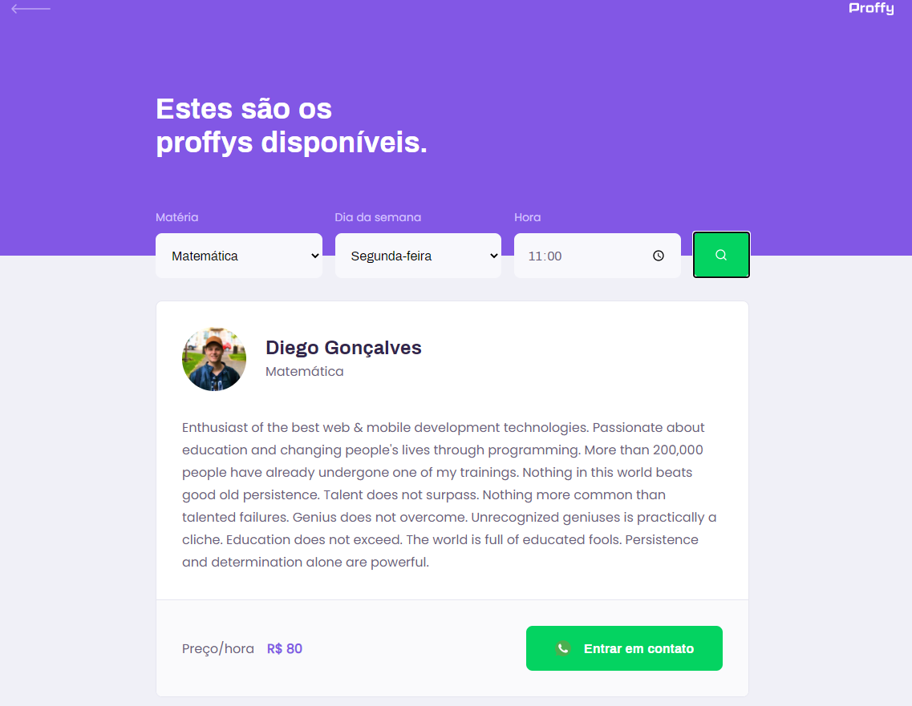

<h1 align="center"></h1>

## :bookmark: Table of contents
- [About the Project](#clipboard-about-the-project)
- [Built With](#hammer-built-with)
- [Getting Started](#rocket-getting-started)
  - [Prerequisites](#heavy_check_mark-prerequisites)
  - [Installation](#gear-installation)
- [Usage](#computer-usage)
- [License](#information_source-license)
- [Contact](#email-contact)
- [Acknowledgements](#purple_heart-acknowledgments)

## :clipboard: About the Project
   <p align="justify">Education can be harsh for numerous reasons: lack of time/interest, bad teachers, raw difficulty... Students many times have to attempt extra hours on a subject or try learning with different educators.<br /><br />
   Proffy presents itself as a bridge between these two worlds: the scholars in need of extra help, and the tutors (proffys) with knowledge and the will to teach others what they know. Through a detailed schedule system, students can quickly find instructors teaching the subject they want, in the days and hours they want. Providing means of direct contact, connections can be easily estabilished, speeding up the educational process.</p>
   
## :hammer: Built With
  - [NodeJS](https://nodejs.org/en/)
  - [ReactJS](https://reactjs.org/)
  - [React Native](https://reactnative.dev/)
  - [Expo](https://expo.io/)
  - [SQLite](https://www.sqlite.org/index.html)
  
## :rocket: Getting Started
Proffy is **NOT** a commercial application. The project was developed exclusively with educational intentions and, as such, haven't been published. With that im mind, if you want to run a local instance of the program for testing and curiosity purposes, please follow these steps:
### :heavy_check_mark: Prerequisites
All of those must be installed before you try to run the project:
  - [NodeJS](https://nodejs.org/en/download/)
  - [NPM](https://www.npmjs.com/get-npm) - *Auto installed with NodeJS*
  - [Expo](https://expo.io/) - **Must also be installed in your cellphone**
### :gear: Installation
After cloning or downloading the project in your local machine, navigate to `Mobile\src\services\api.js` and change the *baseURL* variable to your respective IP. Once this is done, open the project's folder in your terminal and run the following commands:
  ```bash
  # Go to server folder
  $ cd server
  
  # Install all necessary dependencies
  $ npm install
  
  #Instantiate the local database
  $npx run migrate:lastest --knexfile knefile.ts
  
  # Run the server
  $ npm start
  ```
The server will start at port :3333. **Open another terminal and leave this one open**.
  ```bash
  # Go to web folder
  $ cd web
  
  # Install all necessary dependencies
  $ npm install
  
  # Run the application
  $ npm start
  ```
Wait a moment and the application will open at port :3000. **Open another terminal and leave this one open**.
  ```bash
  # Go to mobile folder
  $ cd mobile
  
  # Install all necessary dependencies
  $ npm install
  
  # Run the app
  $ expo start
  ```
Wait a moment and an expo screen will open. Open the Expo app at your cellphone and scan the QR Code now appearing on screen. **Leave this terminal open**.

## :computer: Usage
  In the web version of the app, you can choose between "study" and "give classes". In the first case, you will be presented with filters, respective to the subject, week day and hour in which you wish to have your classes. Once you fill those infos, the list of teachers corresponding to the given filters will appear, each containing all of their information, along with their price, and a button to contact the instructor directly. In the second case, a form will be given for your filling, in which all of the already mentioned info must be provided in order to complete the register process.
  <br />
  
  
  
  
  <br /><br /><br /><br /><br /><br /><br /><br /><br /><br /><br /><br /><br /><br /><br /><br /><br /><br /><br /><br /><br />
  
  In the mobile version, the "give classes" option will merely request you to fill in the form of the web version (feature still to be implemented). The "study" tab will work just like in the web, with the additional option of favoriting teachers.
    
## :information_source: License
  This project is under the [MIT](LICENSE.md) license.
## :email: Contact
  If you like the project and have the interest in contacting me directly, please send an email to [mhenrique.silva408@gmail.com](mhenrique.silva408@gmail.com)
## :purple_heart: Acknowledgments
  This project was developed with the guidance of **Diego Fernandes**, CTO at [Rocketseat](https://rocketseat.com.br/), as product of the "Next Level Week 2" online event.

